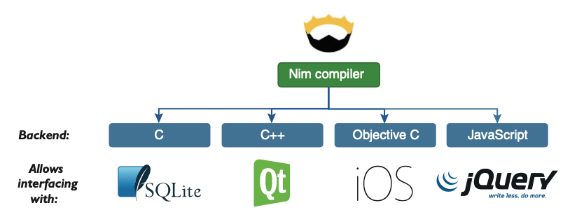
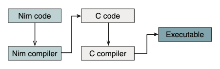
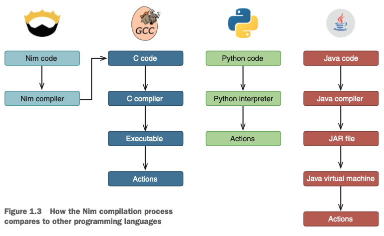
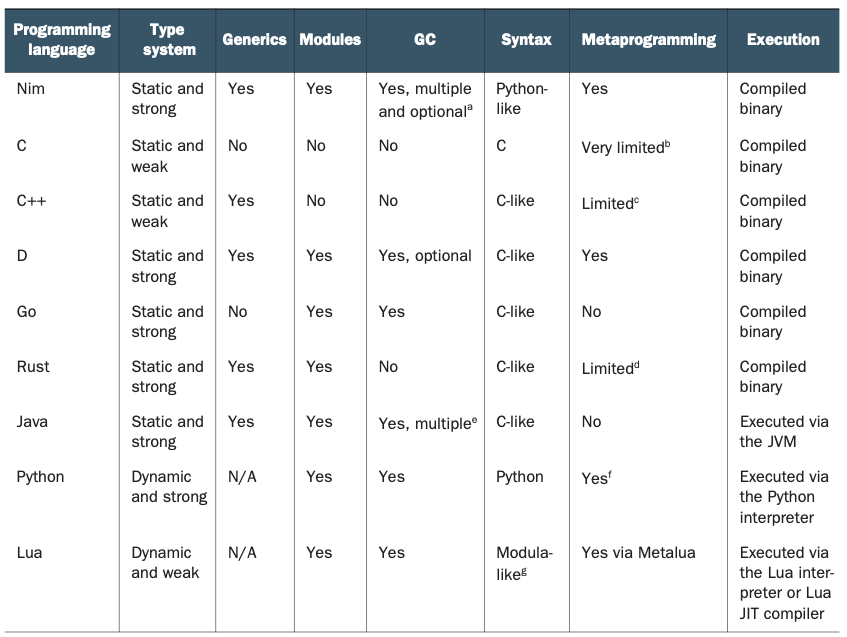

# なぜNimなのか？

  この章では
  - Nimとは？
  - なぜNimを学ぶ必要があるのか
  - Nimと他のプログラミング言語との比較 
  - 使用例
  - 長所と短所

Nimはまだ比較的新しいプログラミング言語です。実際、あなたが手にしているのは、Nimについて書かれた最初の本のひとつです。言語はまだ完全には完成していませんが、構文、プロシージャのセマンティクス、メソッド、イテレータ、ジェネリックス、テンプレートなど、核となる部分はすべて確立されています。その新しさにもかかわらず、Nim が実装しているユニークな機能やユーザーに提供している機能のおかげで、プログラミングコミュニティからは大きな関心が寄せられています。

本章では、なぜNimを使うのかといった、Nimを学ぶ前の疑問に答えます。この章では、Nim の一般的な使用方法、他のプログラミング言語との比較、Nim の長所と短所について説明します。

## 1.1 Nimとは何ですか？

Nimは、効率的で、表現力があり、エレガントであることを目指して設計された汎用プログラミング言語です。この3つの目標を同時に達成するのは難しいので、Nimの設計者はそれぞれに異なる優先順位をつけ、効率性を最も重視し、エレガントさを最も重視しませんでした。

しかし、エレガントさはNimのデザインにとって比較的重要ではないにもかかわらず、デザインプロセスの中で考慮されています。そのため、言語はそれ自体がエレガントであると言えます。効率とエレガントさの間でトレードオフが必要な場合にのみ、効率が優先されるのです。

表面的には、NimはPythonの特徴を多く共有しています。特に、Nimの構文の多くの側面はPythonに似ており、スコープを区切るためにインデントを使用したり、特定の演算子に記号ではなく単語を使用する傾向があります。また、NimはPythonと構文以外の面でも共通しており、例えば、ここで紹介しているように、非常にユーザーフレンドリーな例外トレースバックを採用しています。

```
Traceback (most recent call last)
request.nim(74)          request
request.nim(25)          getUsers
json.nim(837)            []
tables.nim(147)          []
Error: unhandled exception: key not found: totalsForAllResults [KeyError]
```

また、特に言語のセマンティクスに関しては、多くの違いが見られます。主な違いは、型システムと実行モデルにあり、次のセクションで説明します。

  **Nimの歴史を少し紹介します**
    Andreas Rumpf氏がNimの開発を始めたのは2005年のことでした。このプロジェクトはすぐにオープンソースコミュニティからの支持と多くの貢献を得て、世界中の多くのボランティアがGitHubのプルリクエストを通じてコードを提供しています。現在のオープンなNimのプルリクエストは、https://github.com/nim-lang/Nim/pulls で見ることができます。

  **NIMへの貢献** コンパイラ、標準ライブラリ、および関連ツールはすべてオープンソースで、Nimで書かれています。このプロジェクトはGitHubで公開されており、誰でも貢献することができます。Nim に貢献することは、Nim がどのように動作するかを学び、その開発を支援する良い方法です。詳細はNimのGitHubページを参照してください： https://github.com/nim-lang/Nim#contributing.

### 1.1.1 使用例

Nimは、最初から汎用的なプログラミング言語として設計されています。そのため、どのようなソフトウェアプロジェクトにも対応できるよう、幅広い機能を備えています。そのため、ウェブアプリケーションからカーネルまで、さまざまなアプリケーション領域のソフトウェアを書くのに適しています。このセクションでは、いくつかのユースケースにおいて、Nimの機能とプログラミングサポートがどのように適用されるかを説明します。

Nim は実質的にあらゆるアプリケーション・ドメインをサポートしていますが、だからといってすべてに適しているわけではありません。この言語のある側面は、他のアプリケーションよりもいくつかのカテゴリーに適しています。これは、Nimを使って書けないアプリケーションがあるということではなく、Nimが、ある種のアプリケーションを書くのに最適なコードスタイルをサポートしていない可能性があるということです。

Nim はコンパイルされた言語ですが、そのコンパイルの方法は特別です。Nim のコンパイラは、ソースコードをコンパイルする際に、まず C コードに変換します。C言語は古くからサポートされているシステムプログラミング言語で、マシンの物理的なハードウェアへのアクセスをより簡単に、よりダイレクトに行うことができます。このため、Nimはシステムプログラミングに適しており、オペレーティングシステム（OS）、コンパイラ、デバイスドライバ、組み込みシステムソフトウェアなどのプロジェクトを記述することができます。

インターネットに接続された電子機器であるIoT（Internet of Things）デバイスは、Nimの使いやすさとシステムプログラミング能力の高さから、Nimの格好のターゲットとなっています。

Nimのシステムプログラミング機能を利用したプロジェクトの好例として、NimKernelという非常にシンプルなOSがあります。GitHubで公開されています。https://github.com/dom96/nimkern

  **Nimはどのようにソースコードをコンパイルしているのか** Nimの変わったコンパイルモデルとその利点については、1.1.3項で詳しく説明しています。

Nimで書かれたアプリケーションは非常に高速で、多くの場合、C言語で書かれたアプリケーションと同じくらい、Pythonで書かれたアプリケーションの13倍以上の速さです。効率性を最優先し、コードの最適化を容易にする機能もあります。また、ソフトリアルタイムガベージコレクタでは、メモリの収集に費やす時間を指定することができます。通常のガベージコレクタでは、メモリの回収に時間をかけすぎると画面上のフレームの描画が遅くなってしまうため、ゲーム開発ではこの機能が重要になります。また、非常に厳密な時間軸で動作する必要のあるリアルタイムシステムにも有効である。

Nimは、パフォーマンスが重要なコンポーネントを高速化するために、他の低速な言語と一緒に使用することができます。例えば、Rubyで書かれたアプリケーションで、CPUに負荷のかかる計算を必要とするものを、部分的にNimで書くことで、かなりのスピードアップを図ることができます。このような高速化は、科学技術計算や高速取引などの分野で重要です。

また、ファイルの読み込みやネットワーク経由でのデータ送信など、I/O処理を行うアプリケーションもNimに対応しています。例えば、Webアプリケーションは、Jester（https://github .com/dom96/jester）のような多くのWebフレームワークを使って簡単に書くことができます。Nimのスクリプトのような構文と、強力な非同期I/Oのサポートにより、これらのアプリケーションを迅速に開発することができます。

コマンドラインアプリケーションは、Nimの効率性から大きな恩恵を受けることができます。また、Nimアプリケーションはコンパイルされているため、スタンドアロンであり、大規模なランタイムの依存関係を必要としません。そのため、非常に簡単に配布することができます。Nim で書かれたアプリケーションの一つに Nimble があります。これは Nim のパッケージマネージャで、ユーザは Nim のライブラリやアプリケーションをインストールすることができます。

これらは、Nimが適している使用例のほんの一部であり、すべてを網羅しているわけではありません。

また、この記事を書いている時点では、Nimはまだバージョン1.0に達しておらず、開発途上であることも覚えておいてください。まだ実装されていない機能があるため、用途によってはNimに適さない場合もあります。例えば、Nim には、Nim で Web ページ用の JavaScript アプリケーションを書くことができるバックエンドがあります。このバックエンドは動作しますが、言語の他の部分と比べてまだ成熟していません。これは時間とともに改善されるでしょう。

もちろん、NimはJavaScriptにコンパイルできるので、サーバー上やブラウザ上で動作するコンポーネントを必要とするフルスタックアプリケーションに適しています。アプリケーションのブラウザとサーバーの両方のコンポーネントにコードを簡単に再利用できるので、これは非常に大きな利点です。

さて、Nimとは何か、その歴史、そしてNimが特に適しているアプリケーションについて少し理解したところで、Nimの機能とその仕組みについて見ていきましょう。

### 1.1.2 コアな機能

Nimは多くの点で非常に革新的です。Nim の機能の多くは、他のプログラミング言語には見られないものです。新しいプログラミング言語を学ぶのが好きな方、特に面白くてユニークな機能を持つ言語を学びたい方には、Nim は間違いなくお勧めの言語です。

このセクションでは、Nim の中核的な機能、特に他のプログラミング言語と比べて Nim を際立たせている機能を紹介します。

- ニーズに合わせて言語を形成するために使用されるメタプログラミングと呼ばれる機能。
- スタイルインセンシティブな変数名、関数名、型名。この機能を使うと、識別子が `camelCase` や `snake_case` で定義されていても、好きなスタイルで扱うことができますが、これは少し議論の余地があります。
- 型システムにはジェネリックなどの機能が充実しており、コードの作成や保守が容易になります。
- C言語へのコンパイルにより、Nimのプログラムは効率的でポータブルになります。また、コンパイル自体も非常に高速です。
- 様々な種類のガベージコレクターがあり、自由に選択したり、完全に削除することができます。

#### メタプログラミング

Nimの最も実用的で、ある意味でユニークな機能は、広範なメタプログラミングのサポートです。メタプログラミングでは、ソースコードの読み取り、生成、分析、変換を行うことができます。これは決してNimの発明ではありませんが、Nimのように広範囲で同時に簡単に使えるメタプログラミングを備えたプログラミング言語は他にありません。もしあなたがLispに慣れ親しんでいるのであれば、すでにメタプログラミングを経験しているかもしれません。

メタプログラミングでは、コードを抽象的な構文木の形をしたデータとして扱います。これにより、アプリケーションのコンパイル中に、既存のコードを操作したり、まったく新しいコードを生成したりすることができます。

Nimのメタプログラミングが特別なのは、メタプログラミングの機能が充実している言語がLisp系の言語に属しているからです。もしあなたがJavaやPythonに慣れ親しんでいるのであれば、LispよりもNimの方が簡単に使い始めることができるでしょう。また、LispよりもNimのメタプログラミング機能の使い方を学ぶ方が自然だと思います。

一般的には上級者向けのトピックですが、メタプログラミングは非常に強力な機能で、本書の第9章ではその詳細を知ることができます。メタプログラミングがもたらす主な利点の1つは、定型的なコードを取り除くことができることです。また、メタプログラミングによって、ドメイン固有の言語（DSL）を作成することができます。

```
html:
  body:
    p: "Hello World"
```

このDSLは、ちょっとしたHTMLコードを指定するものです。実装方法にもよりますが、このDSLは以下のようなNimコードに翻訳されるようです。

```
echo("<html>")
echo("  <body>")
echo("    <p>Hello World</p>")
echo("  </body>")
echo("</html>")
```

そのNimコードでは、以下のような出力になります。

```
<html>
  <body>
    <p>Hello World</p>
  </body>
</html>
```


Nimのメタプログラミングでは、DSLを定義して、通常のNimコードと自由に組み合わせることができます。このような言語には多くの使用例があります。例えば、先の例では、ウェブアプリケーションのHTMLテンプレートを作成するのに使用できます。

メタプログラミングは、Nimのデザインの中心にあります。Nimの設計者は、ユーザーのプログラミングのスタイルに合わせて、メタプログラミングの使用を奨励したいと考えています。例えば、Nimにはオブジェクト指向プログラミング（OOP）の機能がありますが、クラス定義の仕組みはありません。その代わり、他の言語と同じようなスタイルでNimでOOPを使用したい場合は、メタプログラミングを使用してそのような構造を作成する必要があります。

#### スタイル不感症

Nimのもう一つの興味深い特徴は、スタイル不感症です。プログラマーが最も苦労することの一つは、変数、関数、モジュールなど、様々な識別子の名前を考えることです。多くのプログラミング言語では、これらの名前には空白を含めることができないため、プログラマは1つの名前の中で複数の単語を分離する別の方法を採用せざるを得ませんでした。複数の異なる方法が考案されましたが、最も人気があるのは `snake_case` と `camelCase` です。Nimでは、識別子が`camelCase`で定義されていても、`snake_case`を使うことができますし、その逆も可能です。つまり、使用しているライブラリが識別子に異なるスタイルを採用していても、自分の好きなスタイルでコードを書くことができるのです。

```
Listing 1.1 スタイル不感症
import strutils   <--- strutilsモジュールでは、toUpperという手続きが定義されています。
echo("hello".to_upper()) <--- snake_caseを使って呼び出すことができます。
echo("world".toUpper())  <--- 元々の定義通り、camelCaseを使って呼び出すことができます。
```

これは、Nim が識別子の to_upper と toUpper を同じと見なすためです。識別子を比較するとき、Nim は最初の文字の大文字/小文字を考慮しますが、識別子の残りの文字の大文字/小文字は気にせず、アンダースコアも無視します。その結果、最初の文字の大文字と小文字が異なるため、toUpper と ToUpper という識別子は同じではありません。これにより、型名と変数名を区別することができます。

型名は大文字で始まり、変数名は小文字で始まるのが慣例だからです。次のリストは、この規則が役立つシナリオの1つです。

```
Listing 1.2 スタイル不感症とタイプ識別子
type
  Dog = object  <--- Dogのtypeは大文字の最初の文字で定義されます。
    age: int  <--- 小文字で始まるのはintなどのプリミティブ型だけです。
let dog = Dog(age: 3)  <--- dog変数はDog型と衝突しないので安心して定義できます。
```

#### POWERFUL TYPE SYSTEM

One of the many characteristics that differentiate programming languages from one another is their type system. The main purpose of a type system is to reduce the opportunities for bugs in your programs. Other benefits that a good type system pro- vides are certain compiler optimizations and better documentation of code.
The main categories used to classify type systems are static and dynamic. Most pro- gramming languages fall somewhere between the two extremes and incorporate ideas from both. This is because both static and dynamic type systems require certain trade- offs. Static typing finds more errors at compile time, but it also decreases the speed at which programs can be written. Dynamic typing is the opposite.
Nim is statically typed, but unlike some statically typed programming languages, it also incorporates many features that make development fast. Type inference is a good example of that: types can be resolved by the compiler without the need for you to write the types out yourself (though you can choose to). Because of that, your pro- gram can be bug-free and yet your development speed isn’t hindered. Nim also incor- porates some dynamic type-checking features, such as runtime type information, which allows for the dynamic dispatch of functions.
One way that a type system ensures that your program is free of bugs is by verifying memory safety. Some programming languages, like C, aren’t memory safe because they allow programs to access memory that hasn’t been assigned for their use. Other programming languages are memory safe at the expense of not allowing programs to access low-level details of memory, which in some cases is necessary. Nim combines both: it’s memory safe as long as you don’t use any of the unsafe types, such as `ptr`, in your program, but the `ptr` type is necessary when interfacing with C libraries. Sup- porting these unsafe features makes Nim a powerful systems programming language.
By default, Nim protects you against every type of memory error:

- Arrays are bounds-checked at compile time, or at runtime when compile-time checks aren’t possible, preventing both buffer overflows and buffer overreads.
- Pointer arithmetic isn’t possible for reference types as they’re entirely managed by Nim’s garbage collector; this prevents issues such as dangling pointers and other memory issues related to managing memory manually.
- Variables are always initialized by Nim to their default values, which prevents variables containing unexpected and corrupt data.

Finally, one of the most important features of Nim’s type system is the ability to use generic programming. Generics in Nim allow for a great deal of code reuse without sacrificing type safety. Among other things, they allow you to specify that a single func- tion can accept multiple different types. For example, you may have a `showNumber` procedure that displays both integers and floats on the screen:

```
proc showNumber(num: int | float) =
  echo(num)
showNumber(3.14)
showNumber(42)
```

Here, the `showNumber` procedure accepts either an `int` type or a `float` type. The | operator specifies that both `int` and `float` can be passed to the procedure.
This is a simple demonstration of Nim’s generics. You’ll learn a lot more about Nim’s type system, as well as its generics, in later chapters.

#### COMPILATION

I mentioned in the previous section that the Nim compiler compiles source code into C first, and then feeds that source code into a C compiler. You’ll learn a lot more about how this works in section 1.1.3, but right now I’ll talk about some of the many practical advantages of this compilation model.
The C programming language is very well established as a systems programming language and has been in use for over 40 years. C is one of the most portable pro- gramming languages, with multiple implementations for Windows, Linux, Mac OS, x86, AMD64, ARM, and many other, more obscure OSs and platforms. C compilers sup- port everything from supercomputers to microcontrollers. They’re also very mature and implement many powerful optimizations, which makes C very efficient.
Nim takes advantage of these aspects of C, including its portability, widespread use, and efficiency.
Compiling to C also makes it easy to use existing C and C++ libraries—all you need to do is write some simple wrapper code. You can write this code much faster by using a tool called c2nim. This tool converts C and C++ header files to Nim code, which wraps those files. This is of great benefit because many popular libraries are written in C and C++.
Nim also offers you the ability to build libraries that are compatible with C and C++. This is handy if you want your library to be used from other programming lan- guages. You’ll learn all about wrapping C and C++ libraries in chapter 8.
Nim source code can also be compiled into Objective C and JavaScript. The Objec- tive C language is mainly used for iOS software development; by compiling to it, you can write iOS applications natively in Nim. You can also use Nim to develop Android applications by using the C++ compilation backend. JavaScript is the client-side lan- guage used by billions of websites; it’s sometimes called the “assembly language of the web” because it’s the only programming language that’s supported by all the major web browsers. By compiling to JavaScript, you can write client-side applications for web browsers in Nim. Figure 1.1 shows the available Nim backends.
You may now be wondering just how fast Nim is at compiling software. Perhaps you’re thinking that it’s very slow; after all, Nim needs to translate source code to an intermediate language first. But in fact it’s fairly fast. As an example, the Nim com- piler, which consists of around 100,000 lines of Nim code, takes about 12 seconds to compile on a MacBook Pro with a 2.7 GHz Intel Core i5 CPU. Each compilation is cached, so the time drops to 5 seconds after the initial compilation.


Figure 1.1 Compilation backends

#### MEMORY MANAGEMENT

C and C++ both require you to manually manage memory, carefully ensuring that what you allocate is deallocated once it’s no longer needed. Nim, on the other hand, manages memory for you using a garbage collector. But there are situations when you may want to avoid garbage collectors; they’re considered by many to be inadequate for certain application domains, like embedded systems and games. For this reason, Nim supports a number of different garbage collectors with different applications in mind. The garbage collector can also be removed completely, giving you the ability to manage memory yourself.

  **GARBAGE COLLECTORS** Switching between garbage collectors is easy. You just need to specify the `--gc:<gc_name>` flag during compilation and replace `<gc_name>` with `markandsweep`, `boehm`, or `none`.

This was just a small taste of Nim’s most prominent features. There’s a lot more to it: not just the unique and innovative features, but also the unique composition of fea- tures from existing programming languages that makes Nim as a whole very unique indeed.

### 1.1.3 How does Nim work?

One of the things that makes Nim unique is its implementation. Every programming language has an implementation in the form of an application, which either inter- prets the source code or compiles the source code into an executable. These imple- mentations are called an interpreter and a compiler, respectively. Some languages may have multiple implementations, but Nim’s only implementation is a compiler. The compiler compiles Nim source code by first translating the code to another program- ming language, C, and then passing that C source code to a C compiler, which then compiles it into a binary executable. The executable file contains instructions that indicate the specific tasks that the computer should perform, including the ones spec- ified in the original Nim source code. Figure 1.2 shows how a piece of Nim code is compiled into an executable.
The compilers for most programming languages don’t have this extra step; they compile the source code into a binary executable themselves. There are also others that don’t compile code at all. Figure 1.3 shows how different programming languages transform source code into something that can be executed.


Figure 1.2 How Nim compiles source code


Figure 1.3 How the Nim compilation process compares to other programming languages

Nim connects to the C compilation process in order to compile the C source code that was generated by it. This means that the Nim compiler depends on an external C compiler, such as GCC or Clang. The result of the compilation is an executable that’s specific to the CPU architecture and OS it was compiled on.
This should give you a good idea of how Nim source code is transformed into a working application, and how this process is different from the one used in other pro- gramming languages. Every time you make a change to your Nim source code, you’ll need to recompile it.
Now let’s look at Nim’s positive and negative aspects.


## 1.2 Nim’s benefits and shortcomings

It’s important to understand why you might want to use a language, but it’s just as important to learn why that language may not be correct for your particular use case.
In this section, I’ll compare Nim to a number of other programming languages, focusing on a variety of characteristics and factors that are typically used in such com- parisons. After that, I’ll discuss some of the areas where Nim still needs to catch up with other languages.

### 1.2.1 Benefits

As you read this book, you may wonder how Nim compares to the programming lan- guages that you’re familiar with. There are many ways to draw a comparison and mul- tiple factors that can be considered, including the language’s execution speed, expressiveness, development speed, readability, ecosystem, and more. This section looks at some of these factors to give you a better idea of the benefits of Nim.

#### NIM IS EFFICIENT

The speed at which applications written in a programming language execute is often used in comparisons. One of Nim’s goals is efficiency, so it should be no surprise that it’s a very efficient programming language.
C is one of the most efficient programming languages, so you may be wondering how Nim compares. In the previous section, you learned that the Nim compiler first translates Nim code into an intermediate language. By default, the intermediate lan- guage is C, which suggests that Nim’s performance is similar to C’s, and that’s true.
Because of this feature, you can use Nim as a complete replacement for C, with a few bonuses:

- Nim has performance similar to C.
- Nim results in software that’s more reliable than software written in C.  Nim features an improved type system.
- Nim supports generics.
- Nim implements an advanced form of metaprogramming.

In comparison to C, metaprogramming in Nim is unique, as it doesn’t use a prepro- cessor but is instead a part of the main compilation process. In general, you can expect to find many modern features in Nim that you won’t find in C, so picking Nim as a C replacement makes a lot of sense.
Table 1.1 shows the results of a small benchmark test.(*1) Nim matches C’s speed and is significantly faster than Python.

Table 1.1 Time taken to find which numbers from 0 to 100 million are prime

| Programming language | Time (seconds) |
|:---------------------|:---------------|
| C                    | 2.6            |
| Nim                  | 2.6            |
| Python(CPython)      | 35.1           |

In this benchmark, the Nim application’s runtime matches the speed of the C app and is significantly faster than the app implemented in Python. Micro benchmarks such as this are often unreliable, but there aren’t many alternatives. Nim’s performance matches that of C, which is already one of the most efficient programming languages out there.

#### NIM IS READABLE

Nim is a very expressive language, which means that it’s easy to write Nim code that’s clear to both the compiler and the human reader. Nim code isn’t cluttered with the curly brackets and semicolons of C-like programming languages, such as JavaScript and C++, nor does it require the do and end keywords that are present in languages such as Ruby.
Compare this expressive Nim code with the less-expressive C++ code

```
Listing 1.3 Iterating from 0 to 9 in Nim
for i in 0 .. <10:
  echo(i)
```

```
Listing 1.4 Iterating from 0 to 9 in C++
#include <iostream>
using namespace std;
int main() {
   for (int i = 0; i < 10; i++)
   {
       cout << i << endl;
   }
return 0; }
```

The Nim code is more readable and far more compact. The C++ code contains many elements that are optional in Nim, such as the main function declaration, which is entirely implicit in Nim.
Nim is easy to write but, more importantly, it’s also easy to read. Good code read- ability goes a long way. For example, it makes debugging easier, allowing you to spend more time writing beautiful Nim code, cutting down your development time.

#### NIM STANDS ON ITS OWN

This has been mentioned already, but it’s worth revisiting to describe how other lan- guages compare, and in particular why some require a runtime.
Compiled programming languages such as Nim, C, Go, D, and Rust produce an executable that’s native to the OS on which the compiler is running. Compiling a Nim application on Windows results in an executable that can only be executed on Win- dows. Similarly, compiling it on Mac OS results in an executable that can only be exe- cuted on Mac OS. The CPU architecture also comes into play: compilation on ARM results in an executable that’s only compatible with ARM CPUs. This is how things work by default, but it’s possible to instruct Nim to compile an executable for a differ- ent OS and CPU combination through a process known as cross-compilation.
Cross-compilation is usually used when a computer with the desired architecture or OS is unavailable, or the compilation takes too long. One common use case would be compiling for ARM devices such as the Raspberry Pi, where the CPU is typically slow. More information about cross-compilation can be found in the Nim Compiler User Guide: http://nim-lang.org/docs/nimc.html#cross-compilation.
Among other things, the JVM was created to remove the need for cross-compilation. You may have heard the phrase “write once, run anywhere.” Sun Microsystems created this slogan to illustrate Java’s cross-platform benefits. A Java application only needs to be compiled once, and the result of this compilation is a JAR file that holds all the com- piled Java classes. The JAR file can then be executed by the JVM to perform the pro- grammed actions on any platform and architecture. This makes the JAR file a platform- and architecture-agnostic executable. The downside to this is that in order to run these JAR files, the JVM must be installed on the user’s system. The JVM is a very big depen- dency that may contain bugs and security issues. But on the other hand, it does allow the Java application to be compiled only once.
Python, Ruby, and Perl are similar. They also use a virtual machine (VM) to execute code. In Python’s case, a VM is used to optimize the execution of Python code, but it’s mostly hidden away as an implementation detail of the Python interpreter. The Python interpreter parses the code, determines what actions that code is describing, and immediately executes those actions. There’s no compilation step like with Java, C, or Nim. But the advantages and disadvantages are mostly the same as the JVM’s; there’s no need for cross-compilation, but in order to execute a Python application, the system needs to have a Python interpreter installed.

  **Write once, run anywhere**
  Similar to the “write once, run anywhere” slogan, other programming languages adopted the “write once, compile anywhere” philosophy, giving a computer program the ability to be compiled on all platforms without the need to modify its source code. This applies to languages such as C, Pascal, and Ada. But these languages still require platform-specific code when dealing with more-specialized features of the OS, such as when creating new threads or downloading the contents of a web page. Nim goes a step further; its standard library abstracts away the differences between OSs so you can use a lot of the features that modern OSs offer.

Unfortunately, in many cases, virtual machines and interpreters cause more problems than they solve. The number of common CPU architectures and the most popular OSs is not that large, so compiling for each of them isn’t that difficult. In contrast, the source code for applications written in interpreted languages is often distributed to the user, and they’re expected to install the correct version of the interpreter or vir- tual machine. This can result in a lot of problems.
One example of the difficulty associated with distributing such applications is the recent introduction of Python 3. Because it’s not backward compatible with the previ- ous version, it has caused many issues for software written originally in Python 2. Python 3 was released in 2008, and as of this writing, there are still libraries written for Python 2 that don’t work with the Python 3 interpreter.(*2) This wouldn’t be a problem with a compiled language because the binaries would still continue to work.
The lightweight nature of Nim should make it particularly appealing, especially in contrast to some of the languages mentioned in this section.

#### NIM IS FLEXIBLE

There are many different styles that software can be written in. A programming para- digm is a fundamental style of writing software, and each programming language sup- ports a different set of paradigms. You’re probably already familiar with one or more of them, and at the very least you know what object-oriented programming (OOP) is because it’s taught as part of many computer science courses.
Nim is a multi-paradigm programming language. Unlike some popular program- ming languages, Nim doesn’t focus on the OOP paradigm. It’s mainly a procedural programming language, with varying support for OOP, functional, declarative, concur- rent, and other programming styles.
That’s not to say that OOP isn’t well supported. OOP as a programming style is sim- ply not forced on you. Nim supports common OOP features, including inheritance, polymorphism, and dynamic dispatch.
To give you a better idea of what Nim’s primary paradigm looks like, let’s look at the one big difference between the OOP paradigm and the procedural paradigm. In the OOP paradigm, methods and attributes are bound to objects, and the methods operate on their own data structure. In the procedural paradigm, procedures are standalone entities that operate on data structures. This may be hard for you to visual- ize, so let’s look at some code examples to illustrate it.

**SUBROUTINE TERMINOLOGY** In this subsection I mention methods and proce- dures. These are simply different names for subroutines or functions. Method is the term used in the context of OOP, procedure is used in procedural program- ming, and function is used in functional programming.

The following code listings show the same application. The first is written in Python using the OOP style. The second is written in Nim using the procedural style.

```
Listing 1.5 Barking dog modeled using OOP in Python
class Dog:
  def bark(self): <--- (1)
    print("Woof!")
dog = Dog()
dog.bark() <--- (2)
```
1. The bark method is associated with the Dog class by being defined within it.
2. The bark method can be directly invoked on the dog object by accessing the method via the dot.

```
Listing 1.6 Barking dog modeled using procedural programming in Nim
type
  Dog = object
proc bark(self: Dog) =  <--- (1)
  echo("Woof!")
let dog = Dog()
dog.bark()   <--- (2)
```
1. The bark procedure isn’t directly associated with the Dog type by being defined within it. This procedure could also easily be defined outside this module.
2. The bark procedure can still be directly invoked on the dog object, despite the fact that the procedure isn’t associated with the Dog type as it is in the Python version.

In the Python code, the bark method is placed under the class definition. In the Nim code, the bark method (called a procedure in Nim) isn’t bound to the Dog type in the same way as it is in the Python code; it’s independent of the definition of the Dog type. Instead, its first argument specifies the type it’s associated with.
You could also implement something similar in Python, but it wouldn’t allow you to call the bark method in the same manner. You’d be forced to call it like so: bark(dog), explicitly passing the dog variable to the method as its first argument. The reason this is not the case with Nim is because Nim rewrites dog.bark() to bark(dog), making it possible for you to call methods using the traditional OOP style without hav- ing to explicitly bind them to a class.
This ability, which is referred to as Uniform Function Call Syntax (UFCS), has mul- tiple advantages. It allows you to create new procedures on existing objects externally and allows procedure calls to be chained.

**CLASSES IN NIM** Defining classes and methods in Nim in a manner similar to Python is also possible. Metaprogramming can be used to do this, and the community has already created numerous libraries that emulate the syntax. See, for example, the Nim OOP macro: https://nim-by-example.github .io/oop_macro/.

Another paradigm that Nim supports is the functional programming (FP) paradigm. FP is not as popular as OOP, though in recent years it has seen a surge in popularity. FP is a style of programming that primarily avoids the changing of state and the use of mutable data. It uses certain features such as first-class functions, anonymous func- tions, and closures, all of which Nim supports.
Let’s look at an example to see the differences between programming in a proce- dural style and a functional one. The following code listings show code that separates people’s full names into first and last names. Listing 1.7 shows this done in a func- tional style and listing 1.8 in a procedural style.

```
Listing 1.7 Iterating over a sequence using functional programming in Nim
import sequtils, future, strutils <--- (1)
let list = @["Dominik Picheta", "Andreas Rumpf", "Desmond Hume"]  <--- (2)
list.map(  <--- (3)
  (x: string) -> (string, string) => (x.split[0], x.split[1])  <--- (4)
).echo  <--- (5)
```
1. Imports the sequtils, future, and strutils modules. These modules define the map, ->, and split procedures respectively.
2. Defines new list variable containing a list of names
3. The map procedure is used to iterate over the list.
4. The map procedure takes a closure that specifies how to modify each item in the list.
5. The modified list is then displayed on the screen.

```
Listing 1.8 Iterating over a sequence using a procedural style in Nim
import strutils <--- (1)
let list = @["Dominik Picheta", "Andreas Rumpf", "Desmond Hume"]
for name in list: <--- (2)
  echo((name.split[0], name.split[1])) <--- (3)
```
1. Imports the strutils module, which defines the split procedure
2. A for loop is used to iterate over each item in the list.
3. The code inside the for loop is executed during each iteration; in this case, each name is split into two and displayed as a tuple.

The functional version uses the map procedure to iterate over the list variable, which contains a list of names. The procedural version uses a for loop. Both versions split the name into a first and last name. They then display the result in a tuple. (I’m throw- ing a lot of new terms at you here. Don’t worry if you aren’t familiar with them; I’ll introduce you to them in chapter 2.) The output of the code listings will look similar to this:

```
(Field0: Dominik, Field1: Picheta)
(Field0: Andreas, Field1: Rumpf)
(Field0: Desmond, Field1: Hume)
```

**THE MEANING OF FIELD0 AND FIELD1** Field0 and Field1 are just default field names given to tuples when a field name isn’t specified.

Nim is incredibly flexible and allows you to write software in many different styles. This was just a small taste of the most popular paradigms supported by Nim and of how they compare to Nim’s main paradigm. Nim also supports more-obscure para- digms, and support for others can be introduced easily using metaprogramming.

#### NIM CATCHES ERRORS AHEAD OF TIME

Throughout this chapter, I’ve been comparing Python to Nim. While Nim does take a lot of inspiration from Python, the two languages differ in one important way: Python is dynamically typed and Nim is statically typed. As a statically typed language, Nim provides a certain level of type safety that dynamically typed programming languages don’t provide.
Although Nim is statically typed, it feels very dynamic because it supports type inference and generics. You’ll learn more about these features later in the book. For now, think of it as a way to retain the high development speed that dynamically typed programming languages allow, while also providing extra type safety at compile time.
In addition to being statically typed, Nim implements an exception-tracking mech- anism that is entirely opt-in. With exception tracking, you can ensure that a procedure won’t raise any exceptions, or that it will only raise exceptions from a predefined list. This prevents unexpected crashes by ensuring that you handle exceptions.

#### COMPARING DIFFERENT PROGRAMMING LANGUAGE FEATURES

Throughout this section, I’ve compared Nim to various other programming lan- guages. I’ve discussed efficiency, the dependencies of the resulting software, the flexi- bility of the language, and the language’s ability to catch errors before the software is deployed. Based on these characteristics alone, Nim is an excellent candidate for replacing some of the most popular programming languages out there, including Python, Java, C, and more.
For reference, table 1.2 lists different programming languages and shows some of the features that they do and don’t support.

Table 1.2 Common programming language features


a Nim supports ref counting, a custom GC, and Boehm. Nim also allows the GC to be switched off altogether.
b Some very limited metaprogramming can be achieved via C’s preprocessor.
c C++ only offers metaprogramming through templates, limited CTFE (compile-time function execution), and no AST macros.
d Rust has some support for declarative macros through its macro_rules! directive, but no built-in procedural macros that allow you to transform the AST except for compiler plugins, and no CTFE.
e See the “Oracle JVM Garbage Collectors Available From JDK 1.7.0_04 And After” article on Fasterj: www.fasterj.com/ articles/oraclecollectors1.shtml.
f You can modify the behavior of functions, including manipulating their AST, using the ast module, but only at runtime. 
g Lua uses do and end keywords to delimit scope.

### 1.2.2 Areas where Nim still needs to improve

Nothing in this world is perfect, and programming languages are no exception. There’s no programming language that can solve every problem in the most reliable and rapid manner. Each programming language has its own strengths and weak- nesses, and Nim is no exception.
So far, I’ve been focusing on Nim’s strengths. Nim has many more fine aspects that I haven’t yet mentioned, and you’ll discover them throughout this book. But it would be unfair to only talk about Nim’s strengths. Nim is still a young programming lan- guage, so of course it can still improve.

#### NIM IS STILL YOUNG AND IMMATURE

All programming languages go through a period of immaturity. Some of Nim’s newer and more-advanced features are still unstable. Using them can result in buggy behav- ior in the compiler, such as crashes, though crashes don’t happen very often. Impor- tantly, Nim’s unstable features are opt-in, which means that you can’t accidentally use them.
Nim has a package manager called Nimble. Where other programming languages may have thousands of packages available, Nim only has about 500. This means that you may need to write libraries for certain tasks yourself. This situation is, of course, improving, with new packages being created by the Nim community every day. In chapter 5, I’ll show you how to create your own Nimble packages.

#### NIM’S USER BASE AND COMMUNITY IS STILL QUITE SMALL

Nim has a small number of users compared to the mainstream programming lan- guages. The result is that few Nim jobs exist. Finding a company that uses Nim in pro- duction is rare, but when it does happen, the demand for good Nim programmers can make the salaries quite high.
On the other hand, one of the most unique things about Nim is that its develop- ment is exceptionally open. Andreas Rumpf (Nim’s creator) and many other Nim developers (including me) openly discuss Nim’s future development plans on GitHub and on IRC. Anyone is free to challenge these plans and, because the community is still quite small, it’s easy to do so. IRC is also a great place for newcomers to ask ques- tions about Nim and to meet fellow Nim programmers.

**IRC** Take a look at appendix A for details on how to connect to Nim’s IRC channel.

These problems are temporary. Nim has a bright future ahead of it, and you can help shape it. This book teaches you how.

## 1.3 Summary

- Created by Andreas Rumpf in 2005, Nim is still a very new programming lan- guage; it hasn’t yet reached version 1.0. Because Nim is so new, it’s a bit imma- ture and its user base is relatively small.
- Nim is efficient, expressive, and elegant (in that order).
- Nim is an open source project that’s developed entirely by the Nim community of volunteers.
- Nim is general-purpose programming language and can be used to develop anything from web applications to kernels.
- Nim is a compiled programming language that compiles to C and takes advan- tage of C’s speed and portability.
- Nim supports multiple programming paradigms, including OOP, procedural programming, and functional programming.


-----

1 You can read more about this benchmark test on Dennis Felsing’s HookRace blog: http://hookrace.net/ blog/what-is-special-about-nim/#good-performance.
2 See the Python 3 Readiness page for a list of Python 3–ready packages: http://py3readiness.org/.


