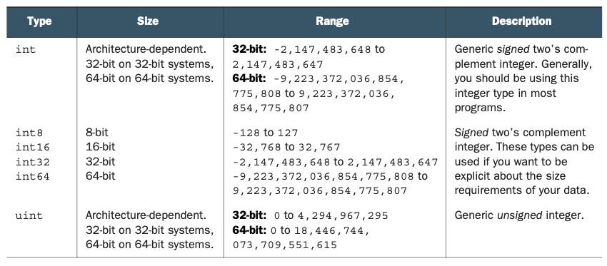
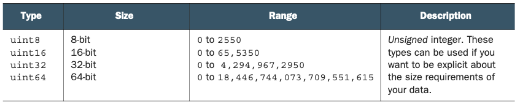

# Getting started

This chapter covers
- Understanding Nim basics  Mastering control flow
- Using collection types
- Handling exceptions
- Defining data types

In this chapter, you’ll learn about Nim’s syntax, procedures, for loops, and other basic aspects of the language. Throughout this chapter, we’ll cover a lot of informa- tion to give you a broad taste of the language.
Before you begin, make sure you have Nim installed and that it works on your computer. You’ll also need a text editor to edit Nim code. Take a look at appendix B for instructions on how to install Nim and other related tools.

## 2.1 Nim syntax

The syntax of a programming language is a set of rules that govern the way pro- grams are written in that language. You’ve already had a small taste of Nim’s syntax in the previous chapter.
Most languages share many similarities in terms of syntax. This is especially true for the C family of languages, which happens to also be the most popular—so much so that four of the most popular programming languages are syntactically heavily inspired by C.(1) Nim aims to be highly readable, so it often uses keywords instead of punctuation. Because of this, the syntax of Nim differs significantly from the C lan- guage family; instead, much of it is inspired by Python and Pascal.
In this section, I’ll teach you the basics of Nim’s syntax. Learning the syntax is a very important first step, as it teaches you the specific ways in which Nim code should be written.

### 2.1.1 Keywords

Most programming languages have the notion of a keyword, and Nim is no exception. A keyword is a word with a special meaning associated with it when it’s used in a specific context. Because of this, you may not use keywords as identifiers in your source code.

**STROPPING** You can get around this limitation by using stropping. See section 1.2 to learn more.

As of version 0.12.0, Nim has 70 keywords. This may sound like a lot, but you must remember that you won’t be using most of them. Some of them don’t yet have a meaning and are reserved for future versions of the language; others have minor use cases.
The most commonly used keywords allow you to do the following:

- Specify conditional branches: `if`, `case`, `of`, and `when`
- Define variables, procedures, and types: `var`, `let`, `proc`, `type`, and `object` 
- Handle runtime errors in your code: `try`, `except`, and `finally`

You’ll learn exactly what these keywords mean and how to use them in the next sec- tions of this chapter. For a full list of keywords, consult the Nim manual, available at http://nim-lang.org/docs/manual.html#lexical-analysis-identifiers-keywords.

### 2.1.2 Indentation

Many programmers indent their code to make the program’s structure more apparent. In most programming languages, this isn’t a requirement and serves only as an aid to human readers of the code. In those languages, keywords and punctuation are often used to delimit code blocks. In Nim, just like in Python, the indentation itself is used.
Let’s look at a simple example to demonstrate the difference. The following three code samples written in C, Ruby, and Nim all do the same thing. But note the differ- ent ways in which code blocks are delimited.

```
Listing 2.1 C
if (42 >= 0) {
  printf("42 is greater than 0");
}
```

```
Listing 2.2 Ruby
if 42 >= 0
  puts "42 is greater than 0"
end
```

```
Listing 2.3 Nim
if 42 >= 0:
  echo "42 is greater than 0"
```

As you can see, C uses curly brackets to delimit a block of code, Ruby uses the keyword end, and Nim uses indentation. Nim also uses the colon character on the line that pre- cedes the start of the indentation. This is required for the if statement and for many others. But as you continue learning about Nim, you’ll see that the colon isn’t required for all statements that start an indented code block.
Note also the use of the semicolon in listing 2.1. This is required at the end of each line in some programming languages (mostly the C family). It tells the compiler where a line of code ends. This means that a single statement can span multiple lines, or multiple statements can be on the same line. In C, you’d achieve both like this:

```
printf("The output is: %d",
  0);
printf("Hello"); printf("World");
```

In Nim, the semicolon is optional and can be used to write two statements on a single line. Spanning a single statement over multiple lines is a bit more complex—you can only split up a statement after punctuation, and the next line must be indented. Here’s an example:

```
echo("Output: ", <--- (1)
  5)
echo(5 +         <--- (1)
 5)
echo(5           <--- (2)
  + 5)
echo(5 +
5)               <--- (3)
```

1. Both of these statements are correct because they’ve been split after the punctuation and the next line has been indented.
2. This statement has been incorrectly split before the punctuation.
3. This statement has not been correctly indented after the split.

Because indentation is important in Nim, you need to be consistent in its style. The convention states that all Nim code should be indented by two spaces. The Nim com- piler currently disallows tabs because the inevitable mixing of spaces and tabs can have detrimental effects, especially in a whitespace-significant programming language.

### 2.1.3 Comments
Comments in code are important because they allow you to add additional meaning to pieces of code. Comments in Nim are written using the hash character (`#`). Any- thing following it will be a comment until the start of a new line. A multiline comment can be created with `#[` and `]#`, and code can also be disabled by using `when false:`. Here’s an example:

```
# Single-line comment
#[
Multiline comment
]#
when false:
  echo("Commented-out code")
```

The first of the two types of multiline comment can be used to comment out both text and code, whereas the latter should only be used to comment out code. The compiler will still parse the code and ensure that it’s syntactically valid, but it won’t be included in the resulting program. This is because the compiler checks `when` statements at com- pile time.

## 2.2 Nim basics

Now that you have a basic understanding of Nim’s syntax, you have a good foundation for learning some of the semantics of Nim. In this section, you’ll learn some of the essentials that every Nim programmer uses on a daily basis. You’ll learn about the most commonly used static types, the details of mutable and immutable variables, and how to separate commonly used code into standalone units by defining procedures.

### 2.2.1 Basic types

Nim is a statically typed programming language. This means that each identifier in Nim has a type associated with it at compile time. When you compile your Nim pro- gram, the compiler ensures that your code is type safe. If it isn’t, compilation termi- nates and the compiler outputs an error. This is in contrast to dynamically typed programming languages, such as Ruby, that will only ensure that your code is type safe at runtime.
By convention, type names start with an uppercase letter. Built-in types don’t follow this convention, so it’s easy for you to distinguish between built-in types and user- defined types by checking the first letter of the name. Nim supports many built-in types, including ones for dealing with the C foreign function interface (FFI). I don’t cover all of them here, but they will be covered later in this book.

**FOREIGN FUNCTION INTERFACE** The foreign function interface (FFI) is what allows you to use libraries written in other programming languages. Nim includes types that are native to C and C++, allowing libraries written in those languages to be used.

Most of the built-in types are defined in the `system` module, which is imported auto- matically into your source code. When referring to these types in your code, you can qualify them with the module name (for example, `system.int`), but doing so isn’t necessary. See table 2.1 for a list of the basic types defined in the system module.

**MODULES** Modules are imported using the `import` keyword. You’ll learn more about modules later in this book.

Table 2.1 Basic types

| Type | Description and uses |
| :--- | :------------------- |
| int  | The integer type is the type used for whole numbers; for example, `52`.|
| float | The `float` is the type used for numbers with a decimal point; for example, `2.5`. |
| string | The `string` type is used to store multiple characters. String literals are created by placing multiple characters inside double quotes: `"Nim is awesome"`. |
| bool | The Boolean type stores one of two values, either `true` or `false`. |
| char | The character type stores a single ASCII character. Character literals are created
by placing a character inside single quotes; for example, `'A'`. |

**INTEGER**

The integer type represents numerical data without a fractional component; that is, whole numbers. The amount of data this type can store is finite, so there are multiple versions of it in Nim, each suited to different size requirements. The main integer type in Nim is `int`. It’s the integer type you should be using most in your Nim pro- grams. See table 2.2 for a list of integer types.

Table 2.2 Integer types




An integer literal in Nim can be represented using decimal, octal, hexadecimal, or binary notation.

```
Listing 2.4 Integer literals
let decimal = 42
let hex = 0x42
let octal = 0o42
let binary = 0b101010
```

Listing 2.4 defines four integer variables and assigns a different integer literal to each of them, using the four different integer-literal formats.
You’ll note that the type isn’t specified for any of the defined variables. The Nim compiler will infer the correct type based on the integer literal that’s specified. In this case, all variables will have the type `int`.
The compiler determines which integer type to use by looking at the size of the integer literal. The type is `int64` if the integer literal exceeds the 32-bit range; other- wise, it’s `int`. But what if you want to use a specific integer type for your variable? There are multiple ways to accomplish this:

```
let a: int16 = 42  <---(1)
let b = 42'i8      <---(2)
```

1. `int16`
2. Uses a type suffix to specify the type of the integer literal

**INTEGER SIZE** Explicitly using a small integer type such as `int8` may result in a compile-time or, in some cases, a runtime error. Take a look at the ranges in table 2.2 to see what size of integer can fit into which integer type. You should be careful not to attempt to assign an integer that’s bigger or smaller than the type can hold.


Nim supports type suffixes for all integer types, both signed and unsigned. The format is `'iX`, where `X` is the size of the signed integer, and `'uX`, where `X` is the size of the unsigned integer.(2)

**FLOATING-POINT**
The floating-point type represents an approximation of numerical data with a frac- tional component. The main floating-point type in Nim is `float`, and its size depends on the platform.


```
Listing 2.5 Float literals
let a = 1'f32
let b = 1.0e19
```

The compiler will implicitly use the `float` type for floating-point literals.
You can specify the type of the literal using a type suffix. There are two type suf- fixes for floats that correspond to the available floating-point types: `'f32` for `float32`
and `'f64` for `float64`.
Exponents can also be specified after the number. Variable b in the preceding list-
ing will be equal to 1x10^(19) (1 times 10 to the power of 19).

**BOOLEAN**
The Boolean type represents one of two values: usually a true or false value. In Nim, the Boolean type is called `bool`.

```
Listing 2.6 Boolean literals
let a = false
let b = true
```

The `false` and `true` values of a Boolean must begin with a lowercase letter.


-----

1 According to the TIOBE Index for December 2016, www.tiobe.com/index.php/content/paperinfo/ tpci/index.html.
2 See the Nim manual for more on numerical constants: http://nim-lang.org/docs/manual.html#lexical- analysis-numerical-constants.


